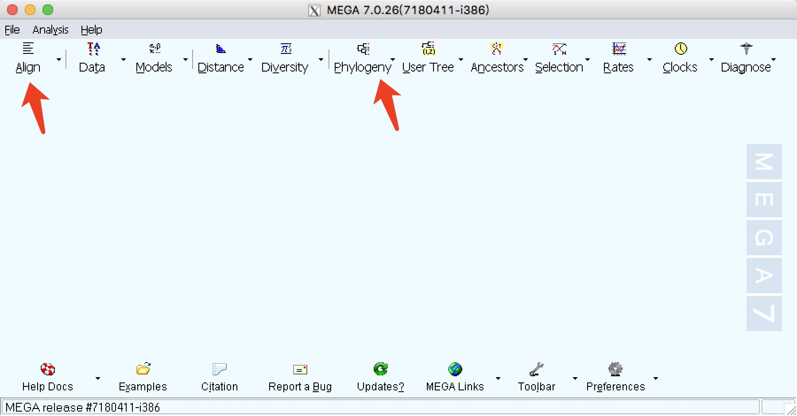
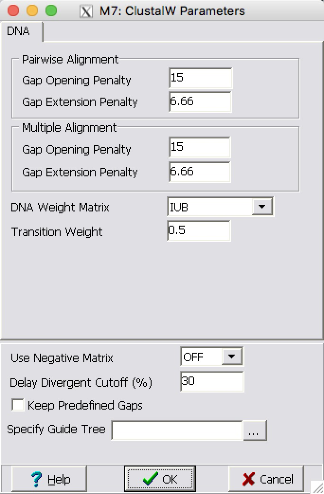

# 序列下载与建树
笔记地址：https://github.com/ViciaYuan/Bioinfo-pipelines/blob/master/bioinfo_training/lecture8_phylogeny.md

<br>

## 准备
### 参考论文
Fan Z, Liu S, Liu Y, et al. Molecular phylogeny and taxonomic reconsideration of the subfamily Zapodinae (Rodentia: Dipodidae), with an emphasis on Chinese species[J]. Molecular Phylogenetics and Evolution, 2009, 51(3): 447-453.

### 使用的序列
* Cytb 细胞色素b,真核生物线粒体中的一种蛋白。电子传递链部分功能，和跨膜蛋白的组分。
* IRBP 光感受器间维生素A类结合蛋白。
这两种蛋白常用来做谱系分析的标记。

<br>

## 序列下载
根据论文中提到的NCBI号，从NCBI上下载需要用来建树的fasta序列。注意序列的命名信息应包括物种拉丁名和是哪种蛋白。

关于从NCBI上批量下载序列:

* NCBI给的指南 https://www.ncbi.nlm.nih.gov/sites/batchentrez
* 使用geneious软件批量下载


<br>

## MEGA7用于比对和建树
这里我们主要用到align和phylogeny的功能。

<center>

mega7界面
</center>

### Align
新建Alignment之后，在Alignment Explorer里倒入序列，进行多序列比对（cyt b、IRBP分别比对）。注意可以同时导入多个序列！

<center>

导入多条序列
</center>

然后按住shift键全部选中点击菜单栏里的alignment，进行比对，这里我选用了默认的参数。
 
<center>

多序列比对参数设置
</center>

几分钟后得到结果，可以把比对结果经过Data-export alignment导出为mega,fasta和nexus格式的文件。

<br>

### phylogeny
然后在主界面的菜单点击phygeny选择刚才导入的meg格式文件进行建树。建树的参数一定设置bootstrap检验和重复次数。

<center>

建树参数设置
</center>

建树的结果保存为mts文件。可以看到bootstrap值都比较高，说明树的可信度较高。这里还需要把外类群序列设置到根结点处。

但是与论文结果比较，有一些差异。。而且因为我用的ML ME方法建树，比NJ法花时间更长，但设置bootstap重复数少伟低可减少时间。

<center>

建树结果
</center>

<br>

## ClustalX
这里用clustal主要是将上一步多序列比对结果.fas转为.nxs文件为下一步使用modeltest作准备。


<center>

clustalx导入多序列比对结果
</center>

<br>

## ModelTest
modeltest jmodeltest都可使用，但是都没有mac的版本。这里放的是同学电脑上跑的流程

1. 打开建树用文件夹中的WIN-PA~1.exe程序，输入命令 exe cytb.nxs，执行程序，执行完成之后，打开cmd，进入建树用文件夹目录，输入命令：Modeltest3.7.win.exe <mdel.scores> cytb.txt，执行命令，最终生成一个cytb.txt文档。
2. 打开cytb.nxs文件，在文档最后加入以下代码：
```
begin mrbayes;
log filename=cytb.txt;
outgroup NC_010339.1_Mus_musculus_muscu;
lset
nst=6
rates=gamma;
set autoclose=yes;
mcmcp
ngen=100000
printfreq=1000
samplefreq=1000
nchains=4
savebrlens=yes
filename=cytb
;
mcmc;
sumt
burnin=25
filename=cytb
contype=allcompat;
end;
```

3. 打开建树用文件夹中的mrbayes.exe程序，输入命令 exe cytb.nxs，执行程序，最后生成各种建树的文件：
4. 
<center>

modeltest生成的文件
</center>

