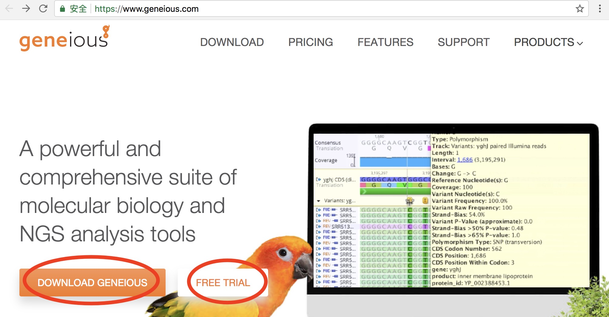
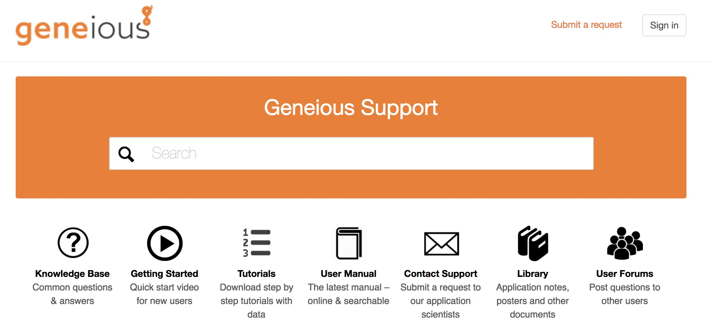

# Geneious的使用|以组装注释并提交叶绿体基因组为例

 

## 安装、申请免费试用与基本操作

 

### 安装与免费使用

在官网https://www.geneious.com/上下载安装，并申请free trial（实验室买了license另说...）。免费试用期有14天...过了要么只能用restricted的版本（几乎没什么功能），要么在虚拟机上的新系统上重复“安装-免费使用14天”的过程。记得分配好geneious运行所需的磁盘和内存大小，不然带不动。

 

### 基本操作

官网support这一栏https://support.geneious.com/hc/en-us提供了丰富的支持。

* Knowledge Base: 有分了类的常见问题
* Tutorial: 下载相应的教程，导入到geneious里能一步一步跟着做，可以快速入门一下各种操作
* Manual: 也可以自己查着用
* Contact Support: 实在没有搜到自己遇到问题的解答，登录提交一个问题，小半天能收到回复

在主页面上方点击Help(带问号的图标)，会在页面最右侧出现一个隔开的窗口，点击里面Tutorial，可以熟悉Geneious的用户界面、文件相关、NCBI搜索、序列查看与编辑、使用功能等的介绍。可以很快熟悉Geneious的基本使用。

1和2是工具栏相关的，3是本地文件，4是从NCBI等上面搜索下载的文件，5是文件列表，6文件查看和编辑区，7查看内存的使用，点击可以回收一部分没在使用的内存。

有目的但不知道怎么操作的时候，多看下Tutorial和查Manual，自己折腾一下怎么用，资源还是挺丰富的。

 

## Map to Reference 比对到参考序列

 
1. 上面示意图的2为tool bar，选中需要map的序列，然后tool bar-> Align/Assemble-> Map to Reference,在弹出的窗口里选择参考序列，即可进行map
2. 产生的结果为一条Nucleotide alignment文件，选择tool bar-> Workflows-> merge mapped sequences，生成一条fasta序列
3. 选中生成的fasta文件，在6文件查看编辑区选择Info可以修改该序列的信息：Name, Common Name, Genetic Code, Organism, Topology 等。

这时候在Sequence View可以看到环状的叶绿体基因组序列（Info里改Topology为circular），没有注释的信息，下一步可以将参考序列的注释信息复制到我们的序列上去。

 

以下Transfer Annotations和Submit to Genbank都有对应的Tutorial文件，可以自己过一遍体会一下，这里只作简单介绍。

 
## Transfer Annotations 复制参考序列的注释信息

有三种Transfer Annotations的方法。
* “Copy To”: 通过比对。转移短的单个注释，或用于整个序列有同源性的短的比对
* "Annotate From": 通过同源性。使用custom feature数据库，适用于注释有不同feature的未比对的序列
* "Transfer Annotation": 通过同源性。在比对或组装中，转移到参考序列或consensus序列，同源性存在于整个或一些比对。

 this method of transfer is only as good as the quality of the alignment. You should always double check the boundaries of all annotations that you have transferred to make sure they are correct.

 

## Submit to Genbank 提交到NCBI 

 
